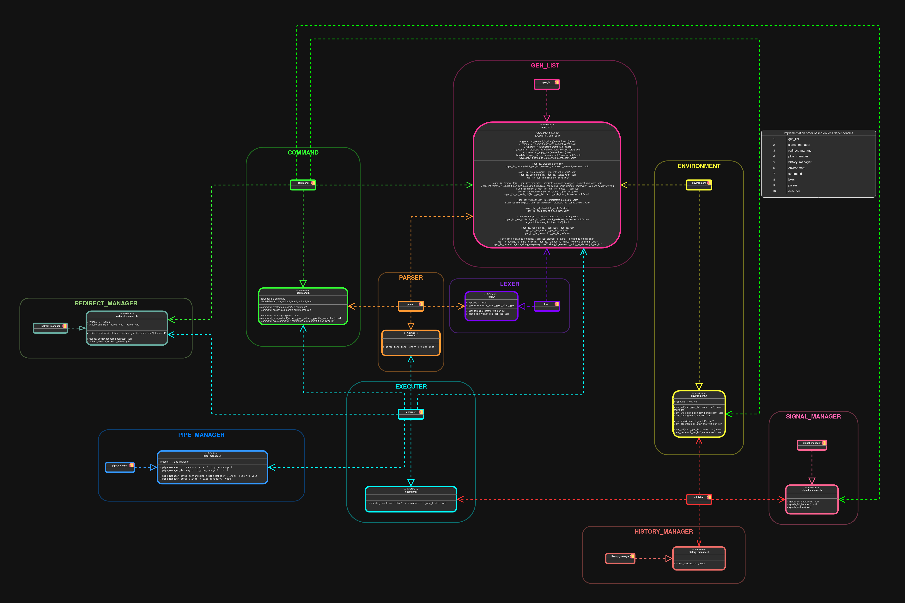

# MiniShell Documentation

Welcome to the MiniShell project documentation!

This project implements a small shell in C.

## 📚 Documentation

Full documentation generated with Doxygen:

[🌐 View online](https://luisgrigore.github.io/Minishell/html/index.html)

